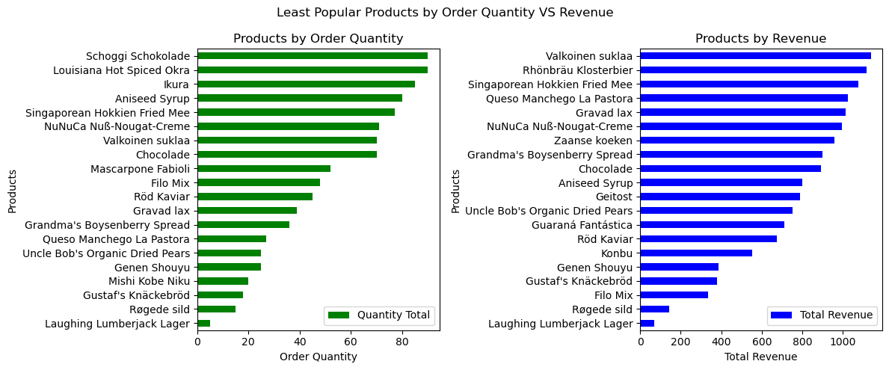
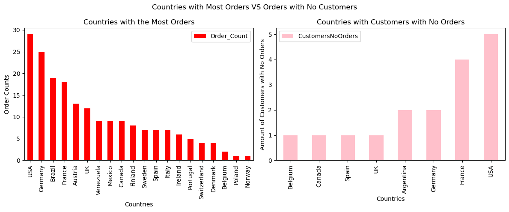
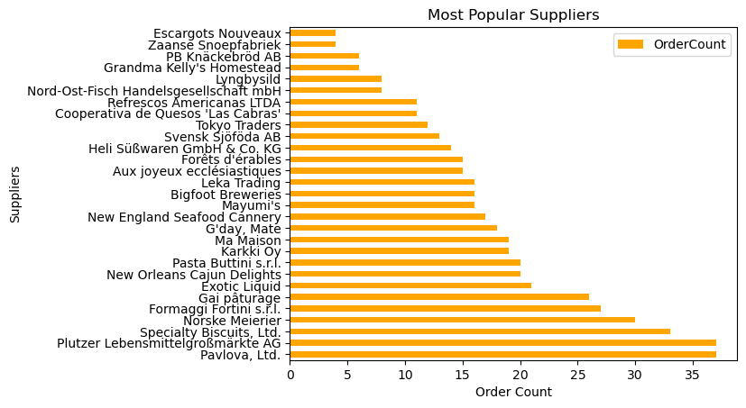

  

# 
Osiris-Foods Ad-hoc Report
 

## 
Client Background

**Osiris-Foods** is a NYC-based wholesale food supplier. 

Reporting to the CEO, an ad-hoc report was conducted to evaluate **Osiris-Foods** performance. This comprehensive review provides valuable insights that will help advance their performance. The report focuses on the following areas:
### Nortstar Metrics
- Customer–Supplier Market Strength
- Product Performance Efficiency
- Country Order Engagement
- Supplier Order Dominance

### Dataset Structure and ERD  
  
*ERD Diagram of Market Database*

## Insights Deep Dive
### Customer-Supplier Market Strength
Which countries have the greatest number of customers? How does this correlate with the number of suppliers by country?

* **USA has the greatest number of customers.** It leads will 13 customers. The next two highest countries with 11 customers are Germany and France. The countries with the greatest numbers of suppliers is also USA with 4 suppliers, and Germany and France with 3 suppliers. Therefore it seems like more customers lead to more suppliers.

  

### Product Performance Efficiency
What is the least popular product by order quantity? How does this correlate with revenue?

* **The least popular product by order quantity is the Laughing Lumberjack Lager with 5 orders.** Next is Røgede sild with 15 quantity orders. The less popular products quantity has less revenue. The Laughing Lumberjack Lager only had $70 in revenue and Røgede sild had the next lowest total revenue with $142.50.

  

### Country Order Engagement
Which country has the most orders? How does this correlate with the number of customers who do not order (i.e. do countries with more ordering customers have more or less non-ordering customers)? Which evidence supports your answer?

* **The USA has the most orders with 29 orders.** The country with the most customers with no orders is USA with 5. **The countries with more ordering customers have more non-ordering customers.** Germany and France also have high order counts with Germany having 25 and France having 18 orders. France has 4 customers with no orders and Germany has 2 customers.

  

### Supplier Order Dominance
Which supplier has the most orders?
* **Pavlolva, Ltd.** and **Plutzer Lebensmittelgroßmärkte AG** have the most orders with 37 orders. 

  

